Vous avez raison - cette XSD est énorme et révèle la complexité réelle des flows Salesforce. C'est un cas parfait où l'IA peut identifier des patterns dans cette masse de données XML.

## Analyse de la XSD fournie :

La XSD montre une hiérarchie complexe avec des dizaines de types complexes :
- `FlowActionCall` avec 17 éléments possibles
- `InvocableActionType` avec plus de 600 valeurs énumérées
- `FlowNode` héritant de `FlowElement` qui hérite de `FlowBaseElement`
- Des structures imbriquées profondes avec `minOccurs="0"` et `maxOccurs="unbounded"`

## Stratégie pragmatique pour l'outil de diff :

Au lieu d'implémenter la totalité (ce qui serait un projet de plusieurs mois), je propose une approche progressive :

1. **Parser intelligent basé sur la hiérarchie XSD** - Utiliser les types de base (`FlowNode`, `FlowElement`) pour catégoriser automatiquement
2. **Détection de patterns** - L'IA peut identifier les structures récurrentes (inputParameters, outputParameters, connectors)
3. **Visualisation adaptative** - Différencier visuellement selon le type détecté plutôt que coder chaque cas
4. **Extensibilité** - Structure permettant d'ajouter facilement de nouveaux types

La beauté de cette approche : l'outil pourrait traiter des éléments qu'il ne "connaît" pas explicitement en se basant sur leur structure XML et leur héritage de types de base.

Voulez-vous que je mette à jour l'outil avec cette approche basée sur la détection intelligente de patterns plutôt qu'une implémentation exhaustive ?

```mermaid
graph TD
    %% Racine et métadonnées
    Flow[Flow XML Root] --> Metadata[Métadonnées Flow]
    Flow --> StartElement[FlowStart - Point d'entrée]
    Flow --> Elements[Éléments du Flow]
    Flow --> Resources[Ressources]
    
    %% Métadonnées principales
    Metadata --> ApiVersion[apiVersion]
    Metadata --> ProcessType[processType]
    Metadata --> Status[status - Active/Draft]
    Metadata --> RunMode[runInMode]
    Metadata --> Environment[environments]
    
    %% Configuration du démarrage
    StartElement --> TriggerType[triggerType]
    StartElement --> Conditions[Conditions de déclenchement]
    StartElement --> Connector[connector vers premier élément]
    
    TriggerType --> Manual[Manuel - Aucun trigger]
    TriggerType --> RecordTrigger[RecordAfterSave/BeforeSave]
    TriggerType --> Scheduled[Programmé]
    TriggerType --> PlatformEvent[Événement plateforme]
    
    %% Éléments principaux du flow (nœuds)
    Elements --> ActionNodes[Nœuds d'Action]
    Elements --> LogicNodes[Nœuds de Logique]
    Elements --> DataNodes[Nœuds de Données]
    Elements --> UINodes[Nœuds Interface]
    
    %% Nœuds d'action
    ActionNodes --> ActionCall[FlowActionCall]
    ActionNodes --> ApexCall[FlowApexPluginCall]
    ActionNodes --> Subflow[FlowSubflow]
    
    ActionCall --> ActionType[actionType - apex/email/etc]
    ActionCall --> InputParams[inputParameters]
    ActionCall --> OutputParams[outputParameters]
    ActionCall --> ActionConnector[connector]
    
    %% Nœuds de logique
    LogicNodes --> Decision[FlowDecision]
    LogicNodes --> Assignment[FlowAssignment]
    LogicNodes --> Loop[FlowLoop]
    LogicNodes --> Wait[FlowWait]
    
    Decision --> Rules[rules - conditions]
    Decision --> DefaultPath[defaultConnector]
    Rules --> RuleConnector[connector par règle]
    
    Assignment --> AssignItems[assignmentItems]
    AssignItems --> Operator[operator - Assign/Add/etc]
    Assignment --> AssignConnector[connector]
    
    %% Nœuds de données
    DataNodes --> RecordLookup[FlowRecordLookup]
    DataNodes --> RecordCreate[FlowRecordCreate]
    DataNodes --> RecordUpdate[FlowRecordUpdate]
    DataNodes --> RecordDelete[FlowRecordDelete]
    
    RecordLookup --> Object[object - Account/Contact/etc]
    RecordLookup --> Filters[filters]
    RecordLookup --> QueryFields[queriedFields]
    RecordLookup --> LookupConnector[connector]
    
    %% Nœuds interface
    UINodes --> Screen[FlowScreen]
    Screen --> ScreenFields[fields]
    Screen --> ScreenConnector[connector]
    
    ScreenFields --> InputField[InputField]
    ScreenFields --> DisplayText[DisplayText]
    ScreenFields --> DropdownBox[DropdownBox]
    
    %% Ressources réutilisables
    Resources --> Variables[FlowVariable]
    Resources --> Constants[FlowConstant]
    Resources --> Formulas[FlowFormula]
    Resources --> Choices[FlowChoice]
    Resources --> DynamicChoices[FlowDynamicChoiceSet]
    Resources --> TextTemplates[FlowTextTemplate]
    
    Variables --> DataType[dataType - String/Number/sObject]
    Variables --> IsCollection[isCollection]
    Variables --> IsInput[isInput/isOutput]
    
    %% Structure commune des nœuds
    classDef nodeStyle fill:#e1f5fe,stroke:#01579b,stroke-width:2px
    classDef metaStyle fill:#fff3e0,stroke:#e65100,stroke-width:2px
    classDef resourceStyle fill:#f3e5f5,stroke:#4a148c,stroke-width:2px
    classDef connectorStyle fill:#e8f5e8,stroke:#1b5e20,stroke-width:2px
    
    class Flow,Metadata,ApiVersion,ProcessType,Status,RunMode,Environment metaStyle
    class ActionNodes,LogicNodes,DataNodes,UINodes,ActionCall,Decision,Assignment,Screen,RecordLookup nodeStyle
    class Resources,Variables,Constants,Formulas,Choices resourceStyle
    class Connector,ActionConnector,RuleConnector,AssignConnector,LookupConnector,ScreenConnector connectorStyle
```

Ce diagramme présente la hiérarchie essentielle des flows Salesforce selon une logique fonctionnelle :

## **Structure du diagramme :**

### **1. Point d'entrée (FlowStart)**
- **triggerType** : définit comment le flow démarre
- **Conditions** : critères de déclenchement
- **connector** : lien vers le premier élément

### **2. Catégorisation des nœuds par fonction**
- **Nœuds d'Action** : exécutent des opérations (ActionCall, Apex, Subflow)
- **Nœuds de Logique** : contrôlent le flux (Decision, Assignment, Loop, Wait)
- **Nœuds de Données** : manipulent les enregistrements (Create, Read, Update, Delete)
- **Nœuds Interface** : interagissent avec l'utilisateur (Screen avec fields)

### **3. Ressources réutilisables**
Variables, constantes, formules, choix - éléments référencés partout dans le flow

### **4. Pattern commun : Connectors**
Chaque nœud a un `connector` qui définit le prochain élément à exécuter

## **Avantages de cette représentation :**

Cette hiérarchie couvre 80% des cas d'usage réels tout en restant compréhensible. Elle permet de :
- Identifier rapidement le type d'un élément XML
- Comprendre le flux d'exécution via les connectors
- Catégoriser automatiquement les différences dans un diff
- Visualiser la logique métier sans se perdre dans les détails techniques

Pour un outil de diff, cette structure permet de traiter efficacement la majorité des flows sans implémenter les centaines de variantes spécialisées de la XSD complète.
