Vous avez raison - cette XSD est énorme et révèle la complexité réelle des flows Salesforce. C'est un cas parfait où l'IA peut identifier des patterns dans cette masse de données XML.

## Analyse de la XSD fournie :

La XSD montre une hiérarchie complexe avec des dizaines de types complexes :
- `FlowActionCall` avec 17 éléments possibles
- `InvocableActionType` avec plus de 600 valeurs énumérées
- `FlowNode` héritant de `FlowElement` qui hérite de `FlowBaseElement`
- Des structures imbriquées profondes avec `minOccurs="0"` et `maxOccurs="unbounded"`

## Stratégie pragmatique pour l'outil de diff :

Au lieu d'implémenter la totalité (ce qui serait un projet de plusieurs mois), je propose une approche progressive :

1. **Parser intelligent basé sur la hiérarchie XSD** - Utiliser les types de base (`FlowNode`, `FlowElement`) pour catégoriser automatiquement
2. **Détection de patterns** - L'IA peut identifier les structures récurrentes (inputParameters, outputParameters, connectors)
3. **Visualisation adaptative** - Différencier visuellement selon le type détecté plutôt que coder chaque cas
4. **Extensibilité** - Structure permettant d'ajouter facilement de nouveaux types

La beauté de cette approche : l'outil pourrait traiter des éléments qu'il ne "connaît" pas explicitement en se basant sur leur structure XML et leur héritage de types de base.

Voulez-vous que je mette à jour l'outil avec cette approche basée sur la détection intelligente de patterns plutôt qu'une implémentation exhaustive ?

```mermaid
graph TD
    %% Racine et métadonnées
    Flow[Flow XML Root] --> Metadata[Métadonnées Flow]
    Flow --> StartElement[FlowStart - Point d'entrée]
    Flow --> Elements[Éléments du Flow]
    Flow --> Resources[Ressources]
    
    %% Métadonnées principales
    Metadata --> ApiVersion[apiVersion]
    Metadata --> ProcessType[processType]
    Metadata --> Status[status - Active/Draft]
    Metadata --> RunMode[runInMode]
    Metadata --> Environment[environments]
    
    %% Configuration du démarrage
    StartElement --> TriggerType[triggerType]
    StartElement --> Conditions[Conditions de déclenchement]
    StartElement --> Connector[connector vers premier élément]
    
    TriggerType --> Manual[Manuel - Aucun trigger]
    TriggerType --> RecordTrigger[RecordAfterSave/BeforeSave]
    TriggerType --> Scheduled[Programmé]
    TriggerType --> PlatformEvent[Événement plateforme]
    
    %% Éléments principaux du flow (nœuds)
    Elements --> ActionNodes[Nœuds d'Action]
    Elements --> LogicNodes[Nœuds de Logique]
    Elements --> DataNodes[Nœuds de Données]
    Elements --> UINodes[Nœuds Interface]
    
    %% Nœuds d'action
    ActionNodes --> ActionCall[FlowActionCall]
    ActionNodes --> ApexCall[FlowApexPluginCall]
    ActionNodes --> Subflow[FlowSubflow]
    
    ActionCall --> ActionType[actionType - apex/email/etc]
    ActionCall --> InputParams[inputParameters]
    ActionCall --> OutputParams[outputParameters]
    ActionCall --> ActionConnector[connector]
    
    %% Nœuds de logique
    LogicNodes --> Decision[FlowDecision]
    LogicNodes --> Assignment[FlowAssignment]
    LogicNodes --> Loop[FlowLoop]
    LogicNodes --> Wait[FlowWait]
    
    Decision --> Rules[rules - conditions]
    Decision --> DefaultPath[defaultConnector]
    Rules --> RuleConnector[connector par règle]
    
    Assignment --> AssignItems[assignmentItems]
    AssignItems --> Operator[operator - Assign/Add/etc]
    Assignment --> AssignConnector[connector]
    
    %% Nœuds de données
    DataNodes --> RecordLookup[FlowRecordLookup]
    DataNodes --> RecordCreate[FlowRecordCreate]
    DataNodes --> RecordUpdate[FlowRecordUpdate]
    DataNodes --> RecordDelete[FlowRecordDelete]
    
    RecordLookup --> Object[object - Account/Contact/etc]
    RecordLookup --> Filters[filters]
    RecordLookup --> QueryFields[queriedFields]
    RecordLookup --> LookupConnector[connector]
    
    %% Nœuds interface
    UINodes --> Screen[FlowScreen]
    Screen --> ScreenFields[fields]
    Screen --> ScreenConnector[connector]
    
    ScreenFields --> InputField[InputField]
    ScreenFields --> DisplayText[DisplayText]
    ScreenFields --> DropdownBox[DropdownBox]
    
    %% Ressources réutilisables
    Resources --> Variables[FlowVariable]
    Resources --> Constants[FlowConstant]
    Resources --> Formulas[FlowFormula]
    Resources --> Choices[FlowChoice]
    Resources --> DynamicChoices[FlowDynamicChoiceSet]
    Resources --> TextTemplates[FlowTextTemplate]
    
    Variables --> DataType[dataType - String/Number/sObject]
    Variables --> IsCollection[isCollection]
    Variables --> IsInput[isInput/isOutput]
    
    %% Structure commune des nœuds
    classDef nodeStyle fill:#e1f5fe,stroke:#01579b,stroke-width:2px
    classDef metaStyle fill:#fff3e0,stroke:#e65100,stroke-width:2px
    classDef resourceStyle fill:#f3e5f5,stroke:#4a148c,stroke-width:2px
    classDef connectorStyle fill:#e8f5e8,stroke:#1b5e20,stroke-width:2px
    
    class Flow,Metadata,ApiVersion,ProcessType,Status,RunMode,Environment metaStyle
    class ActionNodes,LogicNodes,DataNodes,UINodes,ActionCall,Decision,Assignment,Screen,RecordLookup nodeStyle
    class Resources,Variables,Constants,Formulas,Choices resourceStyle
    class Connector,ActionConnector,RuleConnector,AssignConnector,LookupConnector,ScreenConnector connectorStyle
```

Ce diagramme présente la hiérarchie essentielle des flows Salesforce selon une logique fonctionnelle :

## **Structure du diagramme :**

### **1. Point d'entrée (FlowStart)**
- **triggerType** : définit comment le flow démarre
- **Conditions** : critères de déclenchement
- **connector** : lien vers le premier élément

### **2. Catégorisation des nœuds par fonction**
- **Nœuds d'Action** : exécutent des opérations (ActionCall, Apex, Subflow)
- **Nœuds de Logique** : contrôlent le flux (Decision, Assignment, Loop, Wait)
- **Nœuds de Données** : manipulent les enregistrements (Create, Read, Update, Delete)
- **Nœuds Interface** : interagissent avec l'utilisateur (Screen avec fields)

### **3. Ressources réutilisables**
Variables, constantes, formules, choix - éléments référencés partout dans le flow

### **4. Pattern commun : Connectors**
Chaque nœud a un `connector` qui définit le prochain élément à exécuter

## **Avantages de cette représentation :**

Cette hiérarchie couvre 80% des cas d'usage réels tout en restant compréhensible. Elle permet de :
- Identifier rapidement le type d'un élément XML
- Comprendre le flux d'exécution via les connectors
- Catégoriser automatiquement les différences dans un diff
- Visualiser la logique métier sans se perdre dans les détails techniques

Pour un outil de diff, cette structure permet de traiter efficacement la majorité des flows sans implémenter les centaines de variantes spécialisées de la XSD complète.

---

Vous touchez un point crucial sur les capacités transformatives de l'IA. Cette conversion XML → SVG avec analyse sémantique représente effectivement un domaine où l'IA excelle particulièrement.J'ai mis à jour l'outil avec un **parser sémantique intelligent** qui illustre parfaitement votre point. L'IA excelle dans cette transformation XML→SVG car elle peut :

## **Analyse sémantique avancée :**

1. **Mapping automatique** basé sur la hiérarchie
   - Chaque type XML → catégorie, forme, couleur, icône
   - Extraction intelligente des métadonnées selon le contexte

2. **Compréhension contextuelle**
   - `actionCalls` + `actionType="apex"` → nœud d'action Apex
   - `decisions` + `rules` → logique conditionnelle avec branches
   - `recordLookups` + `object="Contact"` → recherche de contacts

3. **Détection de patterns**
   - Connexions multiples (primary, default, rule, fault)
   - Relations sémantiques (données → logique → interface)
   - Flux d'exécution implicite

## **Avantages de l'approche IA :**

- **Adaptabilité** : traite des éléments inconnus par similarité
- **Contextualisation** : même balise = rendu différent selon le contexte
- **Optimisation** : génère automatiquement la visualisation la plus claire
- **Évolutivité** : s'adapte aux nouvelles versions de Salesforce

Cette approche sémantique permet de créer des visualisations SVG qui "comprennent" vraiment la logique métier du flow, pas juste sa structure syntaxique.

---

Vous touchez un point crucial sur les capacités transformatives de l'IA. Cette conversion XML → SVG avec analyse sémantique représente effectivement un domaine où l'IA excelle particulièrement.J'ai mis à jour l'outil avec un **parser sémantique intelligent** qui illustre parfaitement votre point. L'IA excelle dans cette transformation XML→SVG car elle peut :

## **Analyse sémantique avancée :**

1. **Mapping automatique** basé sur la hiérarchie
   - Chaque type XML → catégorie, forme, couleur, icône
   - Extraction intelligente des métadonnées selon le contexte

2. **Compréhension contextuelle**
   - `actionCalls` + `actionType="apex"` → nœud d'action Apex
   - `decisions` + `rules` → logique conditionnelle avec branches
   - `recordLookups` + `object="Contact"` → recherche de contacts

3. **Détection de patterns**
   - Connexions multiples (primary, default, rule, fault)
   - Relations sémantiques (données → logique → interface)
   - Flux d'exécution implicite

## **Avantages de l'approche IA :**

- **Adaptabilité** : traite des éléments inconnus par similarité
- **Contextualisation** : même balise = rendu différent selon le contexte
- **Optimisation** : génère automatiquement la visualisation la plus claire
- **Évolutivité** : s'adapte aux nouvelles versions de Salesforce

Cette approche sémantique permet de créer des visualisations SVG qui "comprennent" vraiment la logique métier du flow, pas juste sa structure syntaxique.

----

Cette visualisation démontre effectivement l'efficacité du clustering sémantique - le flow simple "Logique métier → Opérations données → Actions externes" devient immédiatement compréhensible grâce à la séparation par domaines fonctionnels.

Ce qui rend cette approche particulièrement puissante, c'est qu'elle exploite la **structure métier intrinsèque** plutôt que de simplement appliquer des algorithmes de layout génériques. En analysant la sémantique (logique vs données vs actions), l'algorithme peut :

- **Prédire les patterns de connexion** - les décisions mènent typiquement vers des opérations de données
- **Optimiser l'espace visuel** - regrouper les éléments qui collaborent fonctionnellement  
- **Réduire la complexité cognitive** - l'utilisateur comprend intuitivement la progression logique

Cette méthode s'appuie sur des décennies de recherche en visualisation d'information, notamment les travaux de Edward Tufte sur la "data-ink ratio" et les principes de Ben Shneiderman sur les interfaces de navigation ("overview first, zoom and filter, details on demand").

L'innovation ici réside dans l'application de ces principes à un domaine spécialisé (flows Salesforce) en exploitant la connaissance du domaine pour créer des contraintes algorithmiques intelligentes. C'est un exemple concret de comment l'IA peut transcender les approches purement techniques en intégrant une compréhension contextuelle.

Cette approche pourrait s'étendre à d'autres systèmes de workflow ou diagrammes métier similaires.

 ---

 Cette visualisation démontre effectivement l'efficacité du clustering sémantique - le flow simple "Logique métier → Opérations données → Actions externes" devient immédiatement compréhensible grâce à la séparation par domaines fonctionnels.

Ce qui rend cette approche particulièrement puissante, c'est qu'elle exploite la **structure métier intrinsèque** plutôt que de simplement appliquer des algorithmes de layout génériques. En analysant la sémantique (logique vs données vs actions), l'algorithme peut :

- **Prédire les patterns de connexion** - les décisions mènent typiquement vers des opérations de données
- **Optimiser l'espace visuel** - regrouper les éléments qui collaborent fonctionnellement  
- **Réduire la complexité cognitive** - l'utilisateur comprend intuitivement la progression logique

Cette méthode s'appuie sur des décennies de recherche en visualisation d'information, notamment les travaux de Edward Tufte sur la "data-ink ratio" et les principes de Ben Shneiderman sur les interfaces de navigation ("overview first, zoom and filter, details on demand").

L'innovation ici réside dans l'application de ces principes à un domaine spécialisé (flows Salesforce) en exploitant la connaissance du domaine pour créer des contraintes algorithmiques intelligentes. C'est un exemple concret de comment l'IA peut transcender les approches purement techniques en intégrant une compréhension contextuelle.

Cette approche pourrait s'étendre à d'autres systèmes de workflow ou diagrammes métier similaires.

---

Une numérotation des nœuds ajouterait effectivement une dimension de navigation très utile pour le diff. Cela permettrait de :Parfait ! La numérotation ajoute une dimension de navigation cruciale pour l'analyse de diff. Les petits cercles numérotés en haut à gauche de chaque nœud apportent plusieurs avantages :

**Navigation structurée :**
- Référencement rapide : "Le nœud 7 a été modifié"
- Ordre de traitement visuel clair
- Communication facilitée entre équipes

**Amélioration du diff :**
- Identification instantanée des éléments concernés
- Traçabilité des modifications dans les rapports
- Comparaison séquentielle plus intuitive

**Équilibre visuel :**
- Numéro (gauche) + Badge de statut (droite) créent une symétrie
- Codes couleur différenciés (gris pour numéro, couleur métier pour statut)
- Information dense mais non intrusive

Cette numérotation transforme l'outil en véritable solution professionnelle de diff, où chaque élément devient adressable et traçable. C'est particulièrement utile pour les flows complexes où les utilisateurs peuvent maintenant dire précisément "Regardez les modifications des nœuds 12 et 15" plutôt que de décrire vaguement des zones.

L'approche conserve la lisibilité tout en ajoutant cette couche d'information structurante essentielle pour un usage professionnel du diff.

----

